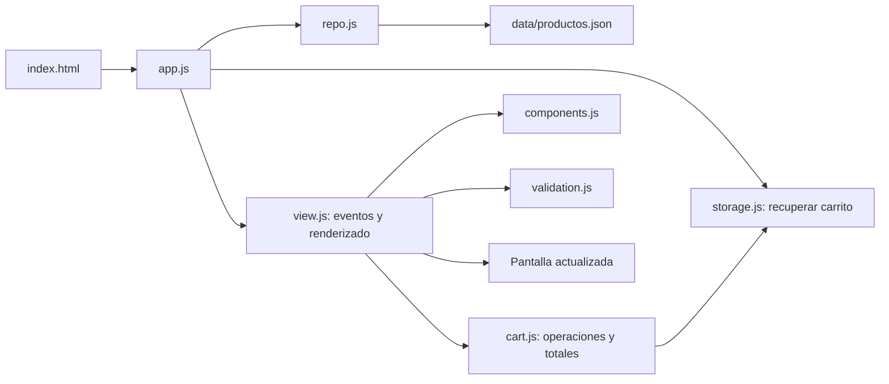

> Cookies: la copia del carrito ahora requiere aceptación en el aviso inicial. Denegar conserva los otros almacenamientos y elimina esa cookie. El pie permite cambiar la preferencia.

> Actualización: el catálogo ahora contiene 284 productos. Para la auditoría de la interfaz y los nuevos filtros consulta [AUDITORIA-PAGINA-WEB.md](AUDITORIA-PAGINA-WEB.md). Los resultados de 20 comprobaciones descritos aquí corresponden a la revisión anterior.

# Auditoría y guía de estudio de MICHOKS

Fecha: 7 de octubre de 2026. Alcance: copia local de `parte_1_bootsrap_tylwind`. Esta auditoría no certifica el contenido publicado en GitHub Pages ni asigna la nota del docente.

## 1. ¿Cumple al 100 % la rúbrica?

**Tiene implementaciones para los diez criterios, pero no es correcto certificar un 100/100 con la evidencia disponible.** La nota máxima exige valorar también calidad del código, presentación, experiencia real con tecnologías de asistencia y todos los estados relevantes de la interfaz.

La validación HTML y las comprobaciones automáticas ofrecen evidencia concreta. No sustituyen la revisión humana de accesibilidad. La [W3C explica las capacidades y límites de las herramientas de evaluación](https://www.w3.org/WAI/test-evaluate/tools/selecting/).

| Criterio y máximo | Evidencia del proyecto | Estado y límite de la conclusión |
| --- | --- | --- |
| HTML5 y estructura accesible — 10 | `index.html` utiliza `header`, `nav`, `main`, `section`, `article`, `aside`, `footer`, `form`, `fieldset`, `details` y `dialog`. Un H1; encabezados de secciones y nombres accesibles. | HTML validado. Las tarjetas `article` se generan en `view.js`; hay que revisar también el contenido dinámico. |
| Responsive — 10 | Grid/Flex; cuadrícula mobile-first; puntos principales de 480, 768 y 1024 px. | Comprobaciones en seis anchos. También existen otras media queries auxiliares; no debe afirmarse que todo el CSS tiene exactamente tres. Falta revisión humana con zoom y dispositivos reales. |
| Reutilización y ARIA — 10 | Funciones compartidas en `components.js`, filtros, menú y diálogos con estados ARIA y teclado. | Implementado y parcialmente comprobado. Las plantillas completas de tarjetas siguen dentro de `view.js`; su reutilización se apoya en funciones compartidas. |
| Regex y validaciones — 10 | `validation.js`, errores dinámicos, `aria-invalid`, `aria-describedby`, foco al primer error y bloqueo de la consulta. | Implementado. Los datos de contacto son opcionales; el formato se valida cuando se completan. La regex de correo verifica una estructura práctica, no la existencia del buzón. |
| JSON/XML — 10 | `data/productos.json`, `fetch`, `response.json()`, validación de datos y recuperación de errores. | Implementado; catálogo de 11 productos. La rúbrica permite JSON o XML: no exige ambos. |
| Carrito — 15 | Añadir, actualizar, eliminar, deshacer, vaciar y calcular totales en centavos. | Funciones principales comprobadas. Es un carrito para consultas, sin pagos ni reservas; la rúbrica citada no exige pagos. |
| Cuatro estrategias de persistencia — 15 | `storage.js`: localStorage, sessionStorage, IndexedDB y cookies con copias versionadas. | Se comprueba que existen las cuatro copias y la recuperación desde cada una. No se promete recuperación si se eliminan todas ni conservación ilimitada por el navegador. |
| POUR — 7 | Texto alternativo, foco visible, etiquetas, mensajes, teclado, movimiento reducido y axe. | Evidencia automática favorable. Pendiente la revisión manual con lector de pantalla, zoom, orden de lectura y estados adicionales. |
| Arquitectura y modularidad — 8 | ES modules; separación de datos, modelo, persistencia, validación y componentes. | Arquitectura modular inspirada en MVC. `view.js` combina renderizado y eventos de controlador; no es un MVC estrictamente separado en tres módulos. |
| Presentación/documentación — 5 | Diseño de marca, logo SVG, recursos locales, README y esta guía. | Entregables presentes. La valoración estética y la explicación oral corresponden al evaluador. |

**Conclusión para presentar:** “El proyecto implementa los diez apartados y cuenta con pruebas automáticas. La puntuación final y el cumplimiento integral de accesibilidad requieren evaluación manual”. No presentes la tabla como una calificación otorgada.

## 2. Validación y ARIA: qué son y cómo se conectan

ARIA aporta información accesible sobre elementos, relaciones y estados. **ARIA no ejecuta la validación**: las reglas JavaScript deciden si un valor es válido; los atributos comunican ese resultado a las tecnologías de asistencia. [Referencia de `aria-invalid` en MDN](https://developer.mozilla.org/en-US/docs/Web/Accessibility/ARIA/Reference/Attributes/aria-invalid).

### Dónde está cada parte

| Archivo | Responsabilidad |
| --- | --- |
| `index.html` | Etiquetas `label`, campos, IDs y relaciones `aria-describedby`. |
| `js/validation.js` | Regex, mensajes, cambio de `aria-invalid` y `setCustomValidity`. |
| `js/view.js` | Eventos del carrito y validación antes de preparar la consulta. |
| `js/components.js` | Navegación de Tab/Shift+Tab dentro de los diálogos. |
| `assets/styles.css` | Foco visible y apariencia de campos inválidos. |

Ejemplo real del correo, abreviado:

```html
<label for="customer-email">Correo</label>
<input id="customer-email" type="email" data-rule="email"
       aria-describedby="customer-email-hint customer-email-error">
<p id="customer-email-hint">Opcional · nombre@dominio.com.</p>
<p id="customer-email-error" aria-live="polite"></p>
```

`for` conecta la etiqueta con el campo. `aria-describedby` lo relaciona con la ayuda y el error mediante sus IDs. `aria-live="polite"` permite anunciar cambios del mensaje sin solicitar una interrupción inmediata.

Cuando falla una regla, `showFieldError()` hace lo siguiente:

```js
input.setAttribute('aria-invalid', String(Boolean(message)));
error.textContent = message;
input.setCustomValidity(message);
```

Un mensaje no vacío produce `aria-invalid="true"`. Al corregirlo, el mensaje se vacía y el estado pasa a `false`. `setCustomValidity('')` también elimina la invalidez personalizada. El formulario usa `novalidate` porque la aplicación controla su flujo de mensajes; esto no significa que carezca de validación.

La validación se activa al salir del campo (`blur`), se actualiza al escribir si ya había un error, y se repite al enviar. Si hay errores se abre la sección plegable correspondiente, se enfoca el primer campo y no se abre WhatsApp. Las cantidades del carrito tienen su validación propia en `view.js` y mensajes asociados a cada ID de producto.

### Ejemplo de regex para estudiar

```js
quantity: /^(?:[1-9]|[1-9][0-9])$/
```

`^` es el inicio y `$` el final. La primera alternativa admite 1–9; la segunda 10–99. `|` significa “o”. No admite `0`, `1.5`, `-2` ni `100`. El modelo también comprueba enteros y rango: la interfaz no es la única defensa.

### Otros atributos que debes poder explicar

| Atributo | Ejemplo de uso |
| --- | --- |
| `aria-label` | Nombre de botones con icono, como abrir o cerrar el carrito. |
| `aria-labelledby` | El diálogo obtiene su nombre del encabezado `cart-title`. |
| `aria-controls` | Relaciona el botón de menú con `main-nav`, o el carrito con `cart-drawer`. |
| `aria-expanded` | Informa si el menú móvil está abierto. |
| `aria-pressed` | Indica la categoría o miniatura seleccionada. |
| `aria-haspopup="dialog"` | Anuncia que un botón abre un diálogo. |
| `aria-hidden="true"` | Oculta iconos decorativos de la lectura accesible. |
| `role="status"` | Identifica avisos, resultados y cambios de selección. |

Se usan elementos nativos, como `button` y `dialog`, para conservar su semántica. No es necesario agregar `role="button"` a un botón nativo. El atributo ARIA debe describir el comportamiento real; por sí solo no lo implementa.

**Respuesta oral breve:** “JavaScript valida los datos y ARIA informa de los errores y estados. CSS muestra el error; el lector de pantalla recibe el mensaje mediante las relaciones y la región viva”.

## 3. Dónde están los estilos y qué hacen

Los estilos principales están en **`assets/styles.css`**. Las fuentes están en **`assets/fonts/fonts.css`**. Ambos archivos se cargan desde el `<head>` de `index.html`:

```html
<link rel="stylesheet" href="assets/fonts/fonts.css">
<link rel="stylesheet" href="assets/styles.css">
```

`styles.css` contiene la base y utilidades CSS generadas previamente con Tailwind, junto con reglas personalizadas para MICHOKS. El sitio actual utiliza CSS ya preparado; no necesita un CDN de Tailwind ni un proceso de compilación para ejecutarse.

| Regla o grupo | Qué modifica |
| --- | --- |
| `:root` y `body` | Paleta básica, fondo, texto y tipografía. |
| `.shell` | Ancho del contenido y márgenes laterales. |
| `.michoks-header`, `.brand` | Cabecera, logotipo y nombre de marca. |
| `.michoks-hero`, `.hero-photo`, `.hero-shade` | Portada, fotografía y capas de contraste. |
| `.primary-button` | Apariencia base de botones destacados. |
| `.catalog-tools`, `.search-box`, `.category-tab` | Búsqueda y filtros. |
| `#product-grid`, `.product-card` | Distribución y apariencia de las tarjetas. |
| `.cart-drawer`, `.cart-layout`, `.cart-footer` | Panel del carrito, columnas y resumen. |
| `.field-error`, `[aria-invalid="true"]` | Mensajes y apariencia de errores. |
| `:focus-visible` | Contorno de foco para navegación por teclado. |
| `@media` | Cambios según ancho, altura y preferencias del usuario. |

Los puntos principales de la cuadrícula son:

```css
#product-grid { grid-template-columns: minmax(0, 1fr); }
/* Desde 480 px: 2 columnas; desde 768 px: 3; desde 1024 px: 4. */
```

Grid distribuye columnas; Flex organiza filas y grupos de controles. `prefers-reduced-motion` reduce las animaciones. `forced-colors` ajusta bordes y foco cuando se utiliza ese modo del sistema.

## 4. ¿Cómo llama `index.html` a los colores?

**Normalmente no llama al color por su nombre: asigna una clase y CSS decide el color.**

```html
<a class="primary-button" href="#catalogo">Descubrir el catálogo</a>
```

La clase `primary-button` se conecta con estas reglas:

```css
:root {
  --ink: #171b17;
  --paper: #f7f7ef;
  --lime: #d7ef71;
  --muted: #62665b;
}
.primary-button {
  background: var(--lime);
  color: var(--ink);
}
```

El HTML elige el componente; `.primary-button` selecciona ese elemento; `var(--lime)` recupera la variable CSS. `background` modifica el fondo y `color` el texto.

### Paleta y ubicación real

| Valor | Nombre/uso en el proyecto |
| --- | --- |
| `#171b17` | `--ink`: texto oscuro y base de varias superficies. |
| `#f7f7ef` | `--paper`: fondo claro de la base. |
| `#d7ef71` | `--lime`: verde lima de marca, botones y detalles. |
| `#62665b` | `--muted`: texto secundario. |
| `#172019` | Oscuro de la identidad más reciente; aparece como valor directo en varias reglas y en el logo. |
| `#f8f8f0` | Fondo final del `body`, definido por una regla posterior. |
| `#fffef8` | Superficies claras de tarjetas; también declarado como `--surface`. |
| `#dce1d2` | Declarado como `--edge`. |

**Hallazgo de auditoría:** `--surface` y `--edge` están declaradas, pero no se usan mediante `var()` en el CSS actual. Hay muchos colores directos además de variables. Cambiar `--lime` no cambia automáticamente los valores `#d7ef71` escritos directamente ni los colores internos del SVG.

El logo tiene sus colores dentro de **`assets/michoks-logo.svg`**, en atributos como `fill` y `stroke`. Un SVG cargado como imagen no hereda automáticamente las variables del documento HTML.

La regla posterior, cuando tiene la misma prioridad, puede reemplazar una anterior. También importa la especificidad: una regla para `.hero-actions .primary-button` es más específica que `.primary-button`. Por eso en DevTools debes revisar el color **calculado**, no solo la primera regla que encuentres.

**Práctica:** inspecciona el botón, abre “Styles/Estilos” y luego “Computed/Calculado”. Identifica qué declaración proporciona su fondo. Prueba un cambio temporal en `--lime` y observa qué partes cambian y cuáles usan colores directos.

## 5. Productos en JSON y para qué sirve JSON

JSON significa **JavaScript Object Notation**. Es un formato de texto para intercambiar datos estructurados. No ejecuta JavaScript, no añade productos por sí mismo y no equivale a una base de datos.

El catálogo está en **`data/productos.json`**. Es un array de 11 objetos. Ejemplo real:

```json
{
  "id": 1,
  "name": "Whisky Johnnie Walker Red Label",
  "category": "Whisky",
  "price": 39.9,
  "size": "750 ml",
  "image": "assets/products/red-label.png",
  "description": "Whisky escocés clásico para llevar, compartir o regalar."
}
```

| Campo | Función |
| --- | --- |
| `id` | Identificador estable y único; el carrito lo usa para relacionar cantidades y productos. |
| `name` | Nombre visible y texto de consulta. |
| `category` | Categoría para filtros y presentación. |
| `price` | Precio numérico para calcular; la moneda y los decimales se formatean en la vista. |
| `size` | Presentación o volumen. |
| `image` | Ruta de la fotografía local. |
| `description` | Texto del detalle. |

Las claves y los strings usan comillas dobles. `price` es un número, no `"$39.90"`. JSON no admite comentarios ni comas finales. Los IDs no necesitan ser consecutivos: no deben repetirse ni cambiarse arbitrariamente.

### Cómo llegan los productos a la pantalla

1. `app.js` llama a `loadProducts()`.
2. `repo.js` ejecuta `fetch()` para obtener el archivo local mediante HTTP.
3. `response.json()` convierte el texto recibido en objetos JavaScript.
4. Se comprueba que haya un array, IDs válidos/únicos, precios y campos correctos.
5. `initView(products)` recibe los datos y `renderProducts()` genera las tarjetas.
6. Si la carga o validación falla, aparece el botón “Volver a cargar”.

La separación permite actualizar nombres, imágenes y precios sin reescribir la estructura de las tarjetas. Para categorías nuevas también hay que revisar los botones de filtro, que están definidos en HTML.

Existe otro archivo, **`assets/products/sources.json`**, con la procedencia de las fotografías. No es la fuente del catálogo que carga la aplicación.

Además, los almacenamientos que reciben texto utilizan `JSON.stringify()` para convertir objetos en texto y `JSON.parse()` para recuperarlos. IndexedDB almacena el objeto mediante su propio mecanismo de clonación estructurada.

**Respuesta oral breve:** “JSON separa los datos de la interfaz. El repositorio carga el catálogo y JavaScript lo transforma en tarjetas y relaciona sus IDs con el carrito”.

## 6. Modelo arquitectónico: cómo explicar el proyecto

Es una **aplicación web estática con módulos ES6 e inspiración MVC**, sin framework MVC ni servidor de pedidos.

| Parte conceptual | Archivos | Responsabilidad |
| --- | --- | --- |
| Datos/repositorio | `data/productos.json`, `repo.js` | Catálogo y lectura/validación de datos. |
| Modelo | `cart.js` | Cantidades, eliminación, recuperación y totales. |
| Persistencia | `storage.js` | Guardar y recuperar el estado del carrito. |
| Vista | `index.html`, `styles.css`, `components.js` y renderizado en `view.js` | Estructura y presentación. |
| Coordinación/controlador | `app.js`, `navigation.js` y eventos en `view.js` | Arranque y respuestas a interacciones. |
| Validación | `validation.js` | Reglas y mensajes accesibles compartidos. |

`view.js` mezcla parte de vista y controlador. Es importante reconocerlo: no debes decir que existe una separación MVC estricta si los eventos y el renderizado están juntos.



Ejemplo al añadir un producto: el evento identifica `data-add-product`, el controlador obtiene el ID, `setQuantity()` construye el siguiente carrito, `saveCart()` solicita persistencia y `renderCart()` actualiza contador, líneas y total. `cart.js` no necesita conocer botones ni HTML para calcular.

El total se suma en centavos: `Math.round(price * 100) * quantity`. Al final se divide entre 100. El formato `$39.90` es presentación; el cálculo utiliza números.

## 7. Cookies: dónde están y cómo funcionan

Se implementan en **`js/storage.js`**, con el nombre **`michoks_cart`**. Guardan una copia compacta del carrito, no nombres, teléfonos, correos ni direcciones del formulario.

El código escribe una cookie mediante `document.cookie`, con atributos equivalentes a:

```text
michoks_cart=<JSON codificado>; Max-Age=2592000; Path=/; SameSite=Lax
```

En HTTPS añade `Secure`. La información incluye la versión del formato, la fecha de actualización y un mapa de IDs/cantidades.

| Parte | Significado |
| --- | --- |
| `encodeURIComponent(text)` | Codifica el JSON para escribirlo como valor de cookie. No lo cifra. |
| `Max-Age=2592000` | 30 días desde la escritura; las escrituras posteriores renuevan ese plazo. |
| `Path=/` | La cookie se aplica a las rutas del host. |
| `SameSite=Lax` | Limita su inclusión en solicitudes entre sitios según las reglas del navegador. |
| `Secure` | En producción HTTPS, limita su envío a conexiones seguras. |

`cookieValue()` busca la cookie por nombre y la decodifica; después se parsea y valida su contenido. Asignar `document.cookie` crea o actualiza una cookie, no reemplaza todas las del sitio. [Referencia de `document.cookie` en MDN](https://developer.mozilla.org/en-US/docs/Web/API/Document/cookie).

Una cookie puede viajar en solicitudes HTTP a rutas coincidentes; localStorage no se envía automáticamente en ellas. Este proyecto no tiene un backend que utilice la cookie para procesar pedidos. La cookie es pequeña porque guarda IDs y cantidades. No usa `HttpOnly`: necesita que JavaScript pueda leerla. No está diseñada como credencial de autenticación.

Para verla, abre DevTools → Application/Almacenamiento → Cookies. En Firefox la sección suele llamarse “Storage”. Localiza `michoks_cart` y revisa su valor y expiración.

## 8. Cómo funciona cada almacenamiento

Todo se coordina desde **`storage.js`**. Se almacenan **copias del mismo estado**, no cuatro carritos diferentes.

| Mecanismo | Clave o ubicación real | Tipo guardado | Duración y uso |
| --- | --- | --- | --- |
| localStorage | `michoks-cart` | String JSON | Persistencia entre visitas; compartido por pestañas del mismo origen. |
| sessionStorage | `michoks-cart` | String JSON | Copia de la sesión de la pestaña, que normalmente termina al cerrarla. |
| IndexedDB | Base `michoks`, almacén `state`, clave `michoks-cart` | Objeto | Copia persistente mediante operaciones asíncronas y transacciones. |
| Cookie | `michoks_cart` | JSON codificado | Copia con plazo de 30 días desde su última escritura. |
| Memoria JS | Variable `memory` | Objeto | Apoyo durante la ejecución; no es una quinta estrategia persistente. |

Web Storage separa localStorage por origen y sessionStorage también por sesión de pestaña. Origen significa protocolo, host y puerto: `localhost:5500` y `localhost:4173` no comparten ese almacenamiento. [MDN — Web Storage](https://developer.mozilla.org/en-US/docs/Web/API/Web_Storage_API).

### localStorage

Al guardar se ejecuta `setItem('michoks-cart', text)`; al leer, `getItem()` y `JSON.parse()`. El acceso es síncrono. `view.js` escucha el evento `storage` para actualizar otra pestaña cuando cambia la copia compartida. El evento no se utiliza para refrescar la misma pestaña que escribió: esa actualiza su interfaz directamente.

### sessionStorage

Usa `setItem()`/`getItem()` como localStorage, pero su ciclo de vida es el de la sesión de la pestaña. Sirve como respaldo al recargar. No reemplaza la persistencia entre sesiones de localStorage o IndexedDB.

### IndexedDB

`indexedDB.open('michoks', 1)` abre la base. Al crearla, `onupgradeneeded` crea el almacén `state`. Para leer se usa `get()` en una transacción `readonly`; para escribir, `put()` en una `readwrite`. La promesa se resuelve al completar la transacción. `queue` serializa escrituras para que una operación antigua no termine sobrescribiendo otra posterior. [MDN — IndexedDB](https://developer.mozilla.org/en-US/docs/Web/API/IndexedDB_API).

El `1` de `indexedDB.open()` es la versión de la estructura de la base. El campo `version` dentro de la copia del carrito es la versión de su formato de datos: son conceptos distintos.

### Formato de las copias

Ejemplo ilustrativo:

```json
{
  "version": 1,
  "updatedAt": 1791417600000,
  "cart": { "1": 2, "4": 3 }
}
```

El mapa significa dos unidades del producto 1 y tres del producto 4. No es necesario copiar los nombres ni precios: se consultan en el catálogo. `updatedAt` es una marca temporal en milisegundos; `version` identifica el formato.

### Recuperación paso a paso

1. `recoverCart(products)` lee localStorage, sessionStorage, cookies e IndexedDB.
2. `snapshot()` descarta JSON corrupto, estructuras inválidas, IDs desconocidos o cantidades fuera de 1–99.
3. `newest()` selecciona la copia válida con mayor `updatedAt`.
4. `persist()` intenta volver a guardarla en los mecanismos disponibles.
5. `initView()` usa la selección recuperada para pintar el carrito.

`persistCart()` genera una actualización con fecha creciente. Al vaciar se guarda `cart: {}` con fecha reciente. Así una copia antigua con productos no se interpreta como la compra que el usuario quiere recuperar.

### Límites reales encontrados

- Si se borran o bloquean todos los mecanismos, no existe un respaldo remoto que recupere compras anteriores.
- La selección de la copia más reciente no fusiona ediciones simultáneas de dos pestañas; sigue una estrategia de última actualización.
- Los errores de IndexedDB se capturan para mantener la interfaz, pero no se muestran individualmente al usuario.
- El resultado booleano de `persist()` cuenta los éxitos síncronos de localStorage, sessionStorage y cookie; no espera la escritura asíncrona de IndexedDB. Por eso puede avisar que no se guardó aunque IndexedDB consiga guardar después. Es un ajuste posible de diagnóstico, no una demostración de pérdida en el uso normal comprobado.
- Los datos personales opcionales se añaden al mensaje de consulta; no forman parte de las cuatro copias del carrito.

## 9. Comprobaciones para la auditoría

El suite está en **`js/tests/rubrica.mjs`**. El README contiene los comandos para ejecutarlo con herramientas temporales fuera del proyecto.

**Resultado de esta ejecución:** `index.html` validado sin errores y **20/20 comprobaciones del suite aprobadas** en Chromium. Esto describe la copia local auditada, no una certificación WCAG ni una nota académica.

La auditoría revisa:

- Validación HTML de `index.html`.
- Las 20 comprobaciones del suite: catálogo, cantidades/totales, eliminación/recuperación, navegación al catálogo, errores ARIA, consulta válida e inválida, cuatro copias de almacenamiento, recuperación desde cada mecanismo, sincronización, vaciado persistente, carga del logo y recuperación de errores de carga.
- Axe y desbordamiento horizontal a 320, 390, 480, 768, 1024 y 1440 px, con catálogo y carrito.
- Permanencia del foco mediante Tab en el carrito y retorno al cerrarlo con Escape.

No equivale a 20 pruebas de todos los comportamientos posibles. El suite actual no comprueba exhaustivamente Shift+Tab, todos los estados del detalle, todos los campos opcionales ni todas las políticas de bloqueo del navegador.

### Revisión manual pendiente para defender la puntuación máxima

| Acción | Qué observar |
| --- | --- |
| VoiceOver/NVDA | Nombres de controles, encabezados, anuncios de error, lectura del carrito y ausencia de contenido modal de fondo. |
| Tab y Shift+Tab | Orden lógico, menú móvil, paneles plegables, foco visible y retorno al cerrar. |
| Zoom 200 % y reflow | Texto legible, contenido y botones completos, sin controles tapados. |
| Casos inválidos | Cantidad decimal, correo incorrecto, celular inválido, dirección corta y etiquetas HTML en indicaciones. |
| Contraste/estados | Hover, foco, deshabilitado, errores, carrito vacío y detalles. |
| Persistencia restringida | Navegación privada y mecanismos bloqueados; mensajes comprensibles y carrito operativo durante la visita. |

## 10. Preguntas para tu exposición

**¿ARIA valida los datos?** No. Las regex y JavaScript validan; ARIA informa de estados, relaciones y errores.

**¿Dónde cambio el verde del botón?** En `assets/styles.css`, revisando `.primary-button`, `--lime` y las reglas específicas que puedan sobrescribirlo. El logo tiene colores dentro del SVG.

**¿Cómo el HTML utiliza CSS?** Carga el archivo mediante `link` y asigna clases como `primary-button`; CSS selecciona esas clases y aplica propiedades.

**¿Por qué JSON?** Para mantener el catálogo separado de la presentación y reutilizar sus datos en tarjetas, detalles y carrito.

**¿Cómo se relaciona el carrito con los productos?** Mediante IDs: el carrito guarda ID/cantidad y consulta la ficha en el array de productos.

**¿Cuál es la diferencia entre JSON y localStorage?** JSON es un formato de datos; localStorage es un mecanismo de almacenamiento. Puede guardar JSON convertido en texto.

**¿Por qué cuatro almacenamientos?** La rúbrica lo exige y se usan como copias de recuperación. En un producto real se escogerían según las necesidades; no siempre se necesitan los cuatro.

**¿Qué diferencia hay entre localStorage y sessionStorage?** El primero persiste entre visitas del mismo origen; el segundo se vincula a la sesión de una pestaña.

**¿IndexedDB guarda strings como localStorage?** Puede guardar objetos mediante transacciones; aquí se guarda una copia del carrito como objeto.

**¿Una cookie está cifrada?** No. `encodeURIComponent()` solo codifica caracteres. `Secure` restringe su envío a HTTPS; no cifra su contenido por sí mismo.

**¿Es MVC puro?** No: es modular e inspirado en MVC; `view.js` también gestiona eventos de controlador.

**¿Cómo evito errores del total?** Se calcula en centavos enteros y se aplica el formato monetario al mostrarlo.

**¿El sitio confirma la compra?** No. Prepara una consulta que el usuario envía por WhatsApp y el negocio confirma.

**¿Puedo decir que tengo 100/100?** Puedes demostrar implementaciones y pruebas. La puntuación final y el cumplimiento integral necesitan revisión del evaluador; no los certifica esta auditoría.
